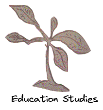
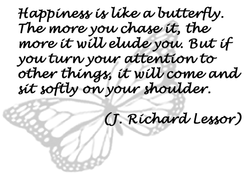
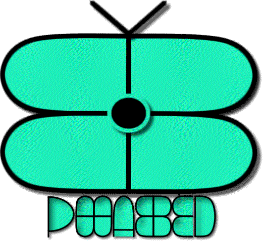

# Welcome

Welcome to PHASED: _Philosophy as Education_. This is my fledgling _digital garden_, or in other words, my public thinking space in which I develop and publish my notes (or seedlings). So, all you read in this garden is dynamic thought in process - an open and evolving conversation which will someday serve as the fruits for my publications, either here in this digital sphere, and/or in the academic and public space.

## About the Garden
My general area of interest is higher education but more specifically a deeper appreciation of Education Studies, i.e., the study of education as the relation between philosophy of education, educational science, and pedagogy.

Four prominent areas are worth mentioning: 
1. _The academic experience of higher education_: A (post-)critical take on the university lifeworld and the student experience. I am particularly interested in depicting the development of students' hermeneutic experiences of understanding.
2. _Social efficiency and instrumentalism in (higher) education_: A (post-)critical perspective (ontology, phenomenology, and philosophical hermeneutics).
3. _Liberal education and the curriculum_: What is the desired/required form of a liberal education for our times? What is powerful knowledge within the curriculum?
4. _The human-technology relation_: One can speak of technology in a twofold manner: 1. The metaphysical condition which evidences human technological consciousness of the everyday; and 2. The condition of the interface between human actors and the products of digital technology/culture -- in other words, _what things do_ as humans co-evolve with technological artefacts.

## Contact
- Email: joey(at)philosophy(dot)education
- [Twitter](@joeyphased)
- [Github](@joeyphased)

## Working in the Open
Except where otherwise noted, content on this site is licensed under a [Creative Commons Attribution-ShareAlike 4.0 International License](https://creativecommons.org/licenses/by-sa/4.0/).

## Staying Updated
Subscribe to my mailing list to get weekly updates on things I have published as well as things I am reading. (Trying to figure out this bit so please email me in the meantime.)

## About the logo

The logo was designed and created by [Mairead McKay](http://maireadmckay.com/) (website to appear soon). It is an abstract design centred on the idea of the butterfly within the following poem[^1]:

I appreciate this poem as the centrepiece to my thought and as one of the ways around which my understanding develops. As per the beauty of poetry, I always see something new in this text. This is education as _poetic dwelling_, or as Hans-Georg Gadamer puts it, a _living in poetry_: 

![[quotes.education#^living-poetry]]

So, rather than what is the typical consciousness of a modern education, i.e., as something which remains within our grasp and control, I understand education as given, or in other words, as a _gift_. The beauty of education is as an unforeseen event which happens to us, often in surprising ways. As Gadamer would say, it is the experience which _pulls us up short_.

[^1]: This poem, erroneously attributed to both Henry David Thoreau and Nathaniel Hawthorne, was written by the social worker, author and speaker, J. Richard Lessor. Although it doesn't appear in any of Lessor's books, it was published on motivational posters in the 1970s produced by Argus Communications. 
